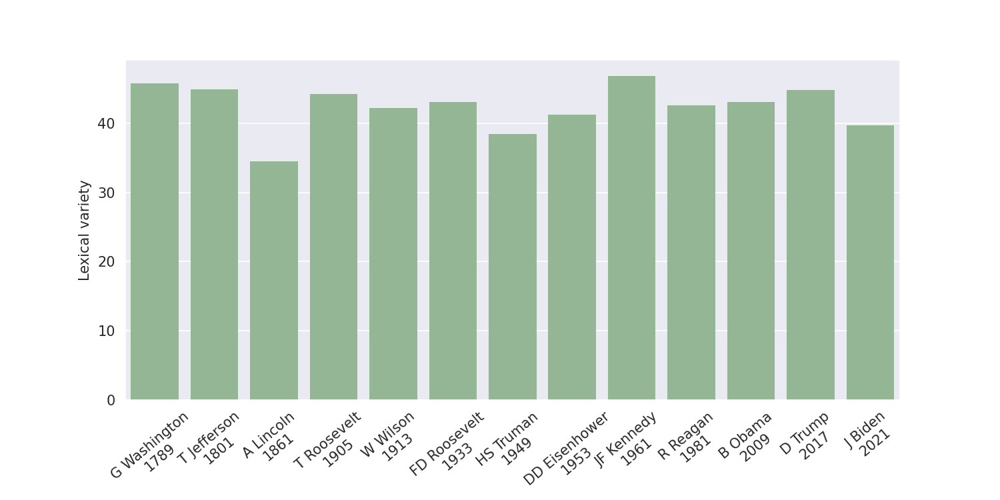
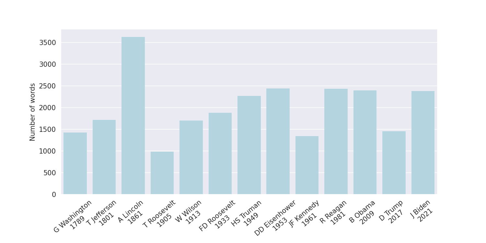
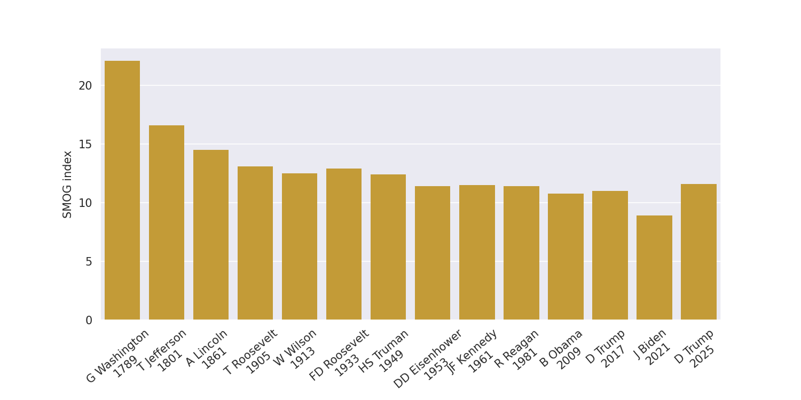
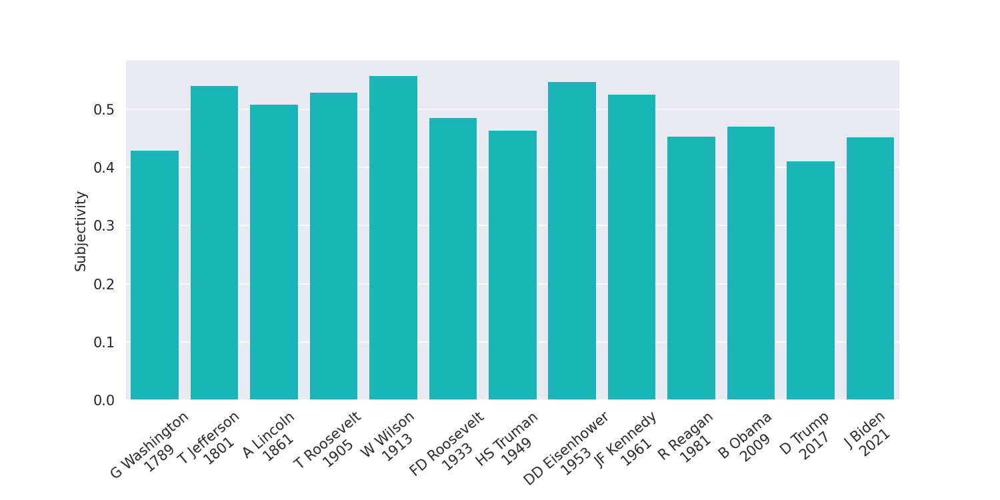

## Analysis of US Inaugural Presidential Addresses
The script and data in this repository are used to analyze
twelve US inaugural presidential addresses through popular
common text readability and sentiment analysis metrics.
You can find the results
[in this blog post](http://www.spinellis.gr/blog/20170120/).

# Results in 20254

![Polarity](Polarity.png

