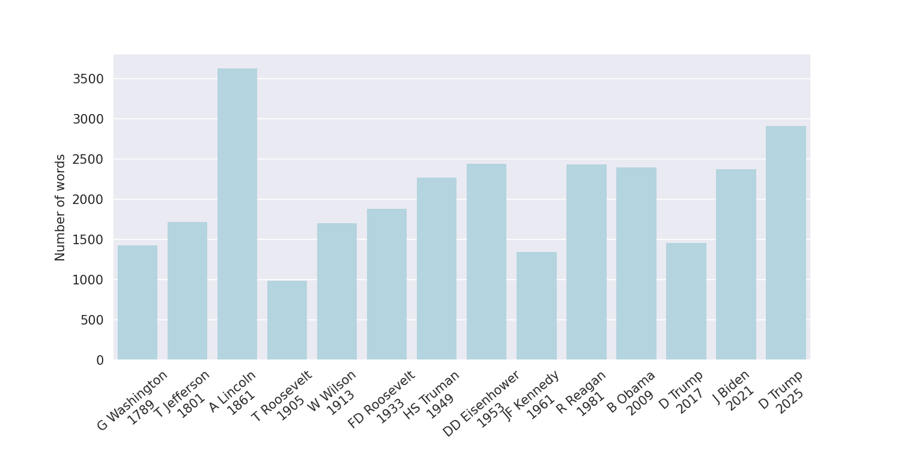
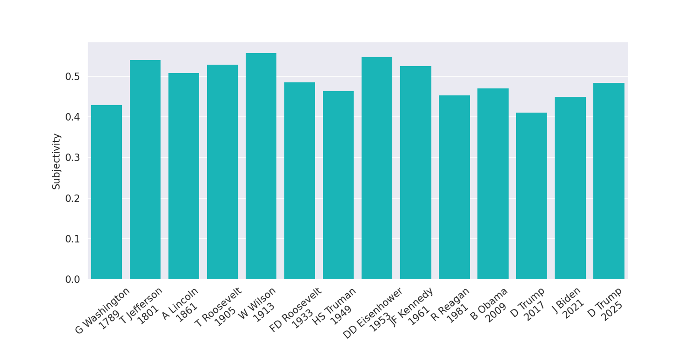

## Analysis of US Inaugural Presidential Addresses 🏛️🇺🇸
The script and data in this repository are used to analyze
twelve US inaugural presidential addresses through popular
common text readability and sentiment analysis metrics.
You can find the results
[in this blog post](http://www.spinellis.gr/blog/20170120/).

# Results in 2024

### Lexical Variety
>Measures the word richness of a text as the percentage ratio between the text’s unique words and all the words in the text

### Number of words
>Total number of words

### Sentimental Polarity
>Classifies the text between negative (less than zero) and positive (greater than zero) sentiments

### SMOG Index 
> Simple Measure of Gobbledygook -  measures its **readability** as an estimate of the years of education needed to understand it

### Subjectivity
>Classifying each sentence as objective or subjective

